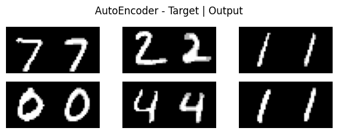
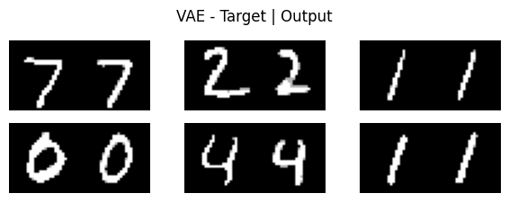
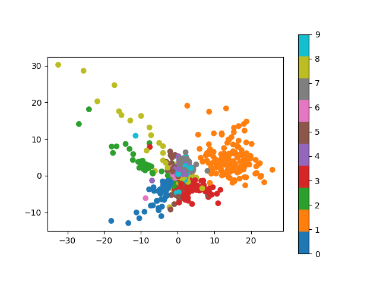
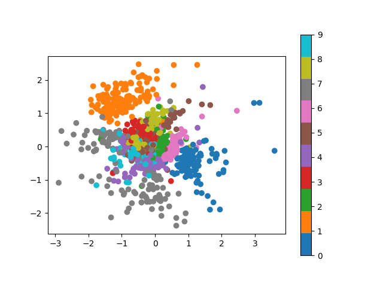
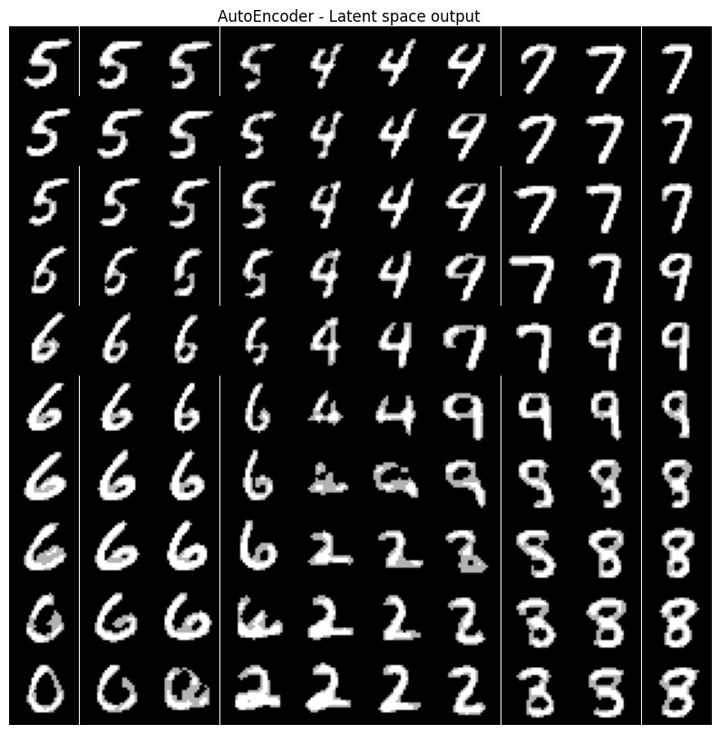
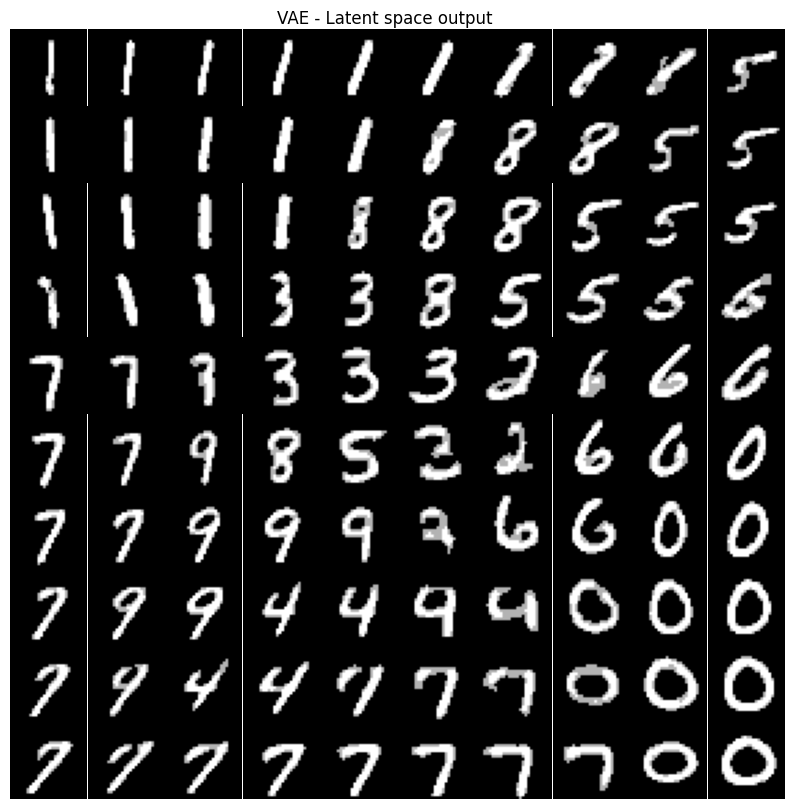
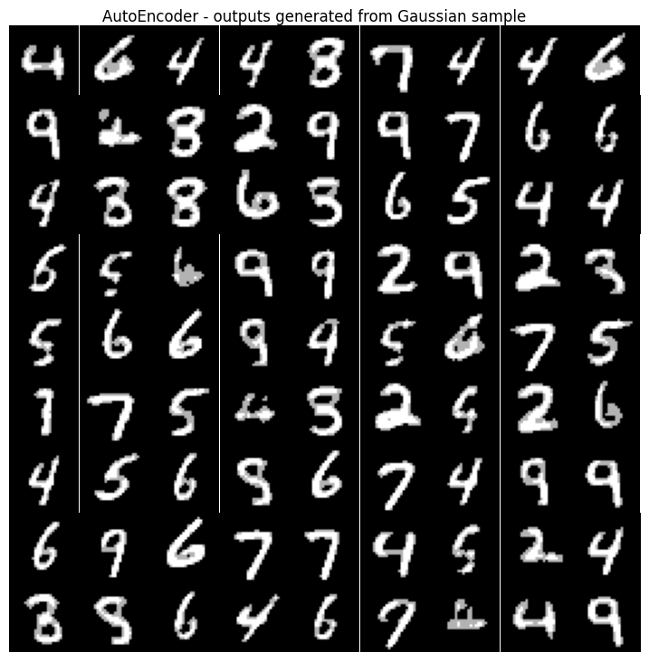
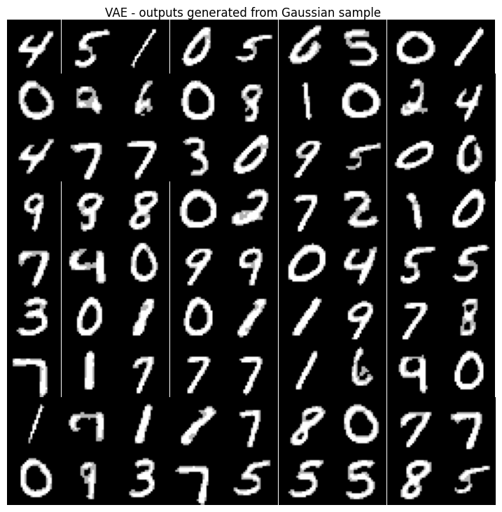

# AutoEncoders vs Variational AutoEncoders

A quick look at how AutoEncoders differ from VAEs. Once the models are trained then generate images exploring the latent space of each model from different perspectives


## What are AutoEncoders and VAEs?

AutoEncoders models are trained to output it's input, but the architecture is such that the model has a restriction of information in the middle of the model. In this example we restrict the middle (the latent space) with 2 dimensions so it is very easy to visualise and plot. Usually the purpose of this is to capture the important information required to reconstruct an almost exact replica of the input. However there is no restriction on the latent space, instead there is only a reconstruction loss (in our case binaryCrossEntropy).

A VAE does have a restriction on it's latent space. Instead the VAE is mapping the input to a distribution (in our case a 2D Gaussian) to then be sampled from to provide an input into the decoder to generate the output. The restriction is that it is learning a Gaussian distribution - this is achieved using the ELBO.


## Latent Space Visuals

There are a few plots we can use to see how the latent space varies between the two models \
Both the models are trained using the MNIST digit dataset

### Performance as AutoEncoders

First before we explore the latent space lets see how well they perform as AutoEncoders. Given an input, how close is the output generated from each model (this is using elements from the validation dataset) \
Clearly both models are pretty good. Note: When training both of the models achieved very similar pixel-wise accuracy (~92%)

AutoEncoder             |  VAE
:-------------------------:|:-------------------------:
  |  

### Latent Space Distribution

Take many digit input images and encode them onto the 2d latent space. Then plot all these points and colour them with their digit number. \
You can see there is no restriction on the AutoEncoder because the latent space is very spread out. Where as the VAE looks a lot more like a Gaussian distribution, meaning you are able to generate images from by sampling from it and generating meaningful outputs, this is not the case with the autoencoder.

AutoEncoder             |  VAE
:-------------------------:|:-------------------------:
  |  


### Decoded Latent Space

In theory the VAE should have a more 'meaningful' latent space where you can sample directly from it and hopefully generate a reasonable output. \
So below is the latent space passed through the decoder to generate images from the range [-1.5, 1.5] in the x-y latent space plane. This is basically a zoomed in version of the plots above and generating digits from each point in the latent space. \
With the AutoEncoder there are larger regions of the latent space that are meaningless and don't generate good outputs, for example the middle-bottom-right section. Whereas the VAE still has these regions but less so, indicating the latent space is more meaningful. 

AutoEncoder             |  VAE
:-------------------------:|:-------------------------:
  |  


### Sample from Latent Space

In theory the VAE should have a more 'meaningful' latent space where you can sample directly from it and hopefully generate a reasonable output. \
Below are images generated from points in the latent space sampled from a 2d Normal Gaussian. You can see there are more generated digits that aren't real digits with the AutoEncoder compared to the VAE generated images.

AutoEncoder             |  VAE
:-------------------------:|:-------------------------:
  |  


## Installation

This project was initially tested with Python=3.10, so I suggest setting up an environment with the same version \
clone the repo then run:
```bash
cd your-cloned-repo
conda create env --name=my_env python=3.10
conda activate my_env
pip install -r requirements.txt
```

## Training Models

Example to train both AutoEncoder and VAE for 20 epochs using you gpu (cuda)
```bash
python train.py --train_autoencoder --train_vae --epochs=20 --use_cuda
```

To then view the training logs
```bash
tensorboard --logdir=logs
```

To see more info for other options use \
`python train.py -h`


## Generating Latent Space Images
Once you've trained models you can use the Jupyter notebook `notebook.ipynb` to see and interact with models. \
Or you can run the following script which generates all images used in this README and saves them down for all trained models
```bash
python explore_latent_space.py
```

To see more info for other options use \
`python explore_latent_space.py -h`
